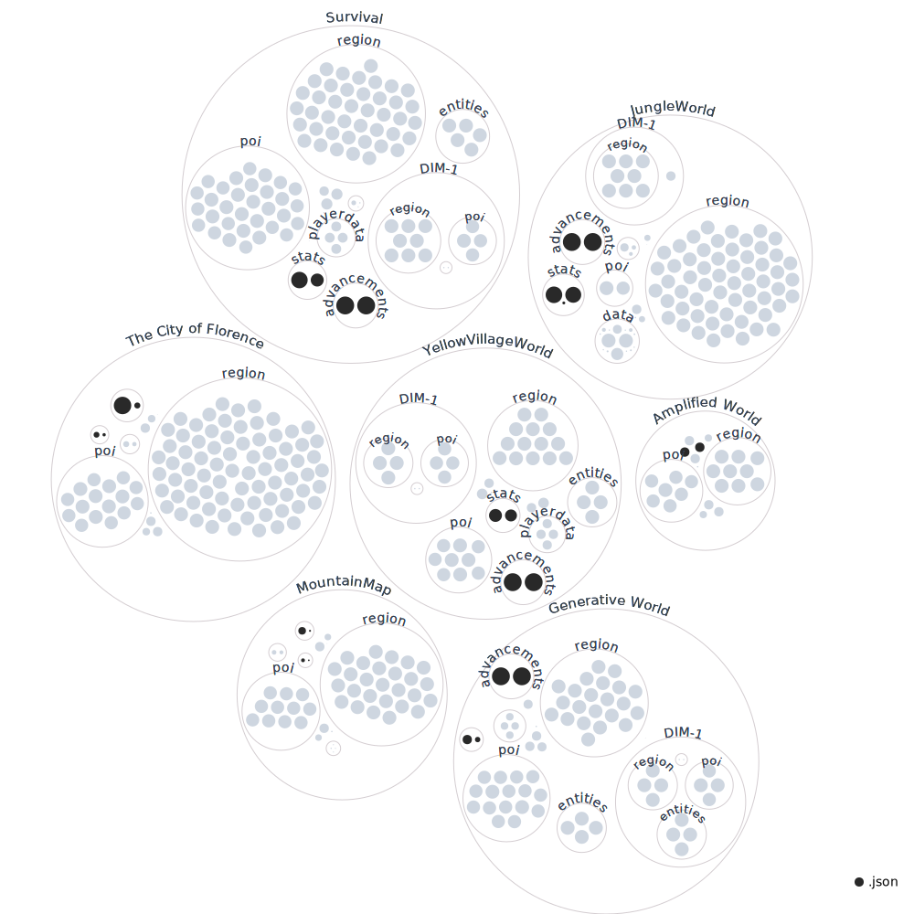

# `MINECRAFTverse` `🧱⛏`

Versioning of some amazing (but also some crappy) minecraft worlds

Here you can get an amazing bird-eye view of our multiverse!

For more information on how to read this graph (and actually much more on how to explore the repo!) you could take a look at the [Java Edition level-format wiki](https://minecraft.fandom.com/wiki/Java_Edition_level_format).
